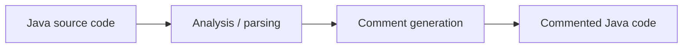

<div align="center">

# 💬 Auto-Commentaire des Codes Java

**Automatic comment generation for Java source code, developed during a research initiation internship at Abdelmalek Essaâdi University**


<!-- Add badges for your actual stack, e.g. Python, NLP, LLM, JavaParser -->

[About](#-about) • [Research Context](#-research-context) • [Approach](#-approach) • [Getting Started](#-getting-started) • [Roadmap](#-roadmap)

</div>

---

## 📖 About

Writing and maintaining comments is essential for code readability and maintenance, yet it is often neglected. This project explores the **automatic generation of comments for Java code**, in order to make source code easier to understand, reuse and maintain.

Given a Java source file, the tool produces explanatory comments describing [classes / methods / key statements, adjust to your project].

---

## 🎓 Research Context

| | |
|---|---|
| **Type** | Research initiation internship |
| **Institution** | Abdelmalek Essaâdi University |
| **Field** | Source code analysis and automatic documentation |
| **Supervisor** | [Supervisor name] |
| **Author** | Hanae KHAYYI |

---

## ✨ Features

| | Module | Description |
|---|---|---|
| 🔍 | **Code analysis** | Parsing and analysis of Java source files |
| 💬 | **Comment generation** | Automatic generation of comments in natural language |
| 📝 | **Commented output** | Source code returned with the generated comments inserted |
| [icon] | [Feature] | [Add the features that are actually implemented] |

---

## 🧱 Approach



> Replace this diagram with your real pipeline (e.g. templates, NLP model, LLM, rule-based analysis) and describe each step in one or two sentences.

**Example**

```java
// Before
public int add(int a, int b) {
    return a + b;
}

// After
/**
 * [Generated comment, paste a real output from your tool]
 */
public int add(int a, int b) {
    return a + b;
}
```

---

## 🛠️ Tech Stack

`Java` · [Libraries / frameworks used] · [IDE / build tool]

---

## 🚀 Getting Started

**Prerequisites:** JDK [version], [other requirements]

```bash
# Clone
git clone https://github.com/hanaekhayyi/Auto-commentaire-des-codes-java-.git
cd Auto-commentaire-des-codes-java-

# Compile and run (adapt to your project)
javac [MainClass].java
java [MainClass]
```

---

## 📊 Results & Limitations

- **Results:** [what works well, evaluation method, sample outputs]
- **Limitations:** [what the tool does not handle yet]

---

## 🧭 Roadmap

- [ ] Support more Java constructs (generics, lambdas, annotations)
- [ ] Improve the quality and relevance of generated comments
- [ ] Add an evaluation protocol on open-source Java projects
- [ ] Provide a command-line interface or IDE plugin
- [ ] Add unit tests and a `README` usage guide

---

<div align="center">

### 👩‍💻 Author

**Hanae KHAYYI** · Data & AI Engineering Student

*Research initiation internship, Abdelmalek Essaâdi University*

[](https://github.com/hanaekhayyi)

⭐ *If you found this project useful, feel free to star the repository.*

</div>
